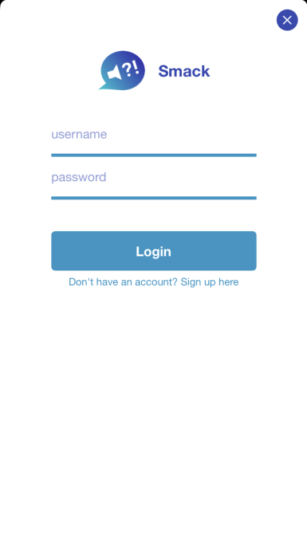
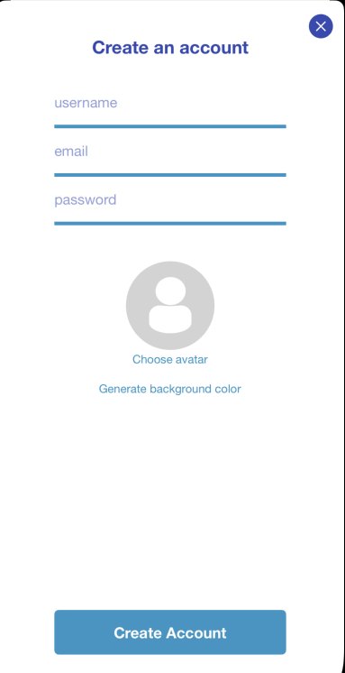
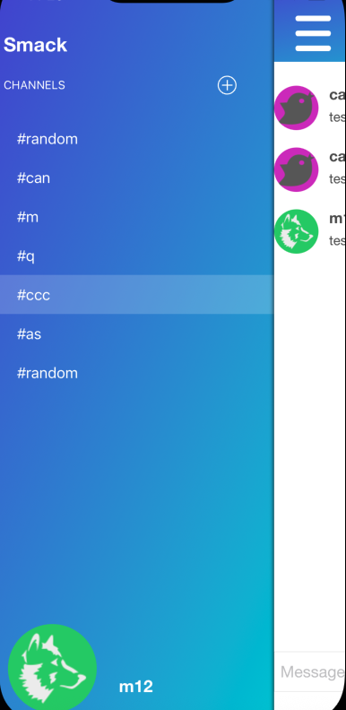
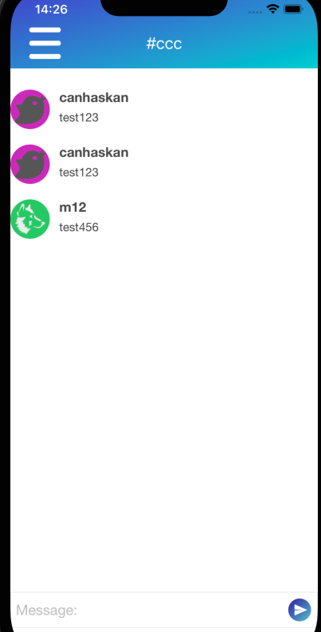
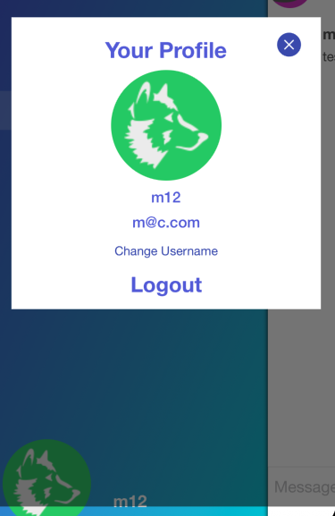
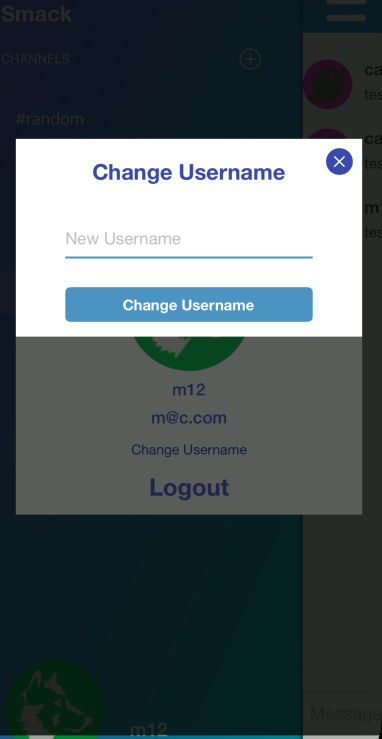
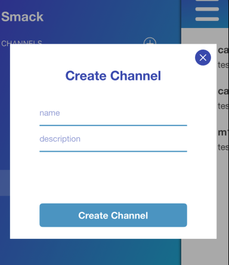

# ChatApp

> A lightweight iOS chat application built with Swift and a custom backend using **MongoDB** and REST API.

## 📌 About
ChatApp is a simple messaging application that communicates with a custom REST API.  
The backend uses **MongoDB** for storing users and messages, and Postman is used for testing endpoints.

## ✨ Features
- Email & password authentication (custom API)
- Username change (profile editing)
- Real-time–like messaging (API polling / refresh)
- User profiles & avatars
- Channel list & chat screen
- Create new channels

## 🚀 Installation
```bash
git clone https://github.com/CanHaskan/ChatApp.git
cd ChatApp
```

### API Setup
This app requires a running backend API.

Your API MUST provide endpoints such as:
- `/auth/register`
- `/auth/login`
- `/messages`
- `/channels`
- `/users/profile`

If the API is not running or the base URL is incorrect, the app will not function.

You can test all endpoints using **Postman**.

### Update API Base URL
Inside the project:
```swift
struct API {
    static let baseURL = "http://your-api-url.com/api"
}
```

### iOS Setup
If you use CocoaPods:
```bash
pod install
open ChatApp.xcworkspace
```

Or open:
```
ChatApp.xcodeproj
```

## 🧰 Usage
- Launch the app
- Register or log in
- Select a channel
- Start chatting

## 📸 Screenshots

### Login & Register
| LoginVC | CreateAccountVC |
|-------|----------|
|  |  |

### Channels & Chat
| ChannelVC | ChatVC |
|----------|------|
|  |  |

### Profile & Change Username
| XIB/ProfileVC | XIB/ChangeUsernameVC |
|----------|-----------------|
|  |  |

### AddChannelVC


## 📂 Project Structure
```
Smack/
 ├─ AppDelegate.swift
 ├─ SceneDelegate.swift
 ├─ Info.plist
 ├─ Assets.xcassets
 ├─ Base.lproj/          # Storyboards or localization files
 ├─ Controller/          # ViewControllers
 ├─ View/                # UI Views
 ├─ Model/               # User, Message models
 ├─ Services/            # Networking, API services
 ├─ Utilities/           # Helpers, extensions
 ├─ Supporting Files/    # Additional config files
 └─ XIBs/                # Reusable XIB components
```

## 📄 License
MIT
